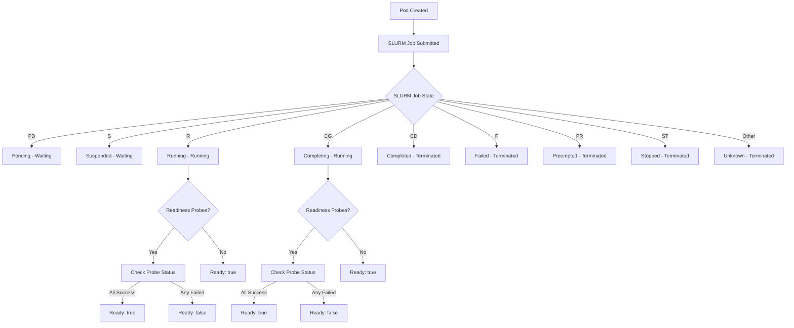

# Pod State Machine Documentation

This document describes the pod lifecycle and state transitions in the interlink-slurm-plugin, based on SLURM job states and their mapping to Kubernetes container states.

## Overview

The plugin maps SLURM job states to Kubernetes pod/container states through a comprehensive state machine. Each pod corresponds to one SLURM job, and the plugin translates SLURM's job status into appropriate Kubernetes container states.

## SLURM State to Kubernetes Mapping

### State Transition Flow



## State Definitions

### 1. **PD (Pending)**
- **SLURM**: Job is awaiting resource allocation
- **Kubernetes State**: `Waiting`
- **Container Ready**: `false`
- **Description**: Job submitted but not yet started due to resource constraints or queue position

### 2. **S (Suspended)**  
- **SLURM**: Job has been suspended by user or system
- **Kubernetes State**: `Waiting`
- **Container Ready**: `false`
- **Description**: Job execution temporarily halted

### 3. **R (Running)**
- **SLURM**: Job is currently executing
- **Kubernetes State**: `Running`
- **Container Ready**: Depends on readiness probes
- **StartTime**: Set when first entering this state
- **Readiness Logic**:
  - **No probes**: `Ready: true`
  - **With probes**: `Ready: true` only if all readiness probes return `SUCCESS`

### 4. **CG (Completing)**
- **SLURM**: Job is in the process of completing (some processes may still be finishing)
- **Kubernetes State**: `Running` 
- **Container Ready**: Depends on readiness probes
- **StartTime**: Set when first entering this state
- **Description**: Job completing but not fully terminated yet

### 5. **CD (Completed)**
- **SLURM**: Job has terminated with exit code 0
- **Kubernetes State**: `Terminated`
- **Container Ready**: `false`
- **ExitCode**: Retrieved from container status files or SLURM exit code
- **FinishedTime**: Set when entering this state

### 6. **F (Failed)**
- **SLURM**: Job failed or was terminated abnormally
- **Kubernetes State**: `Terminated`
- **Container Ready**: `false`
- **ExitCode**: Non-zero exit code from container or SLURM
- **FinishedTime**: Set when entering this state
- **Note**: Includes Leonardo temporary F status handling

### 7. **PR (Preempted)**
- **SLURM**: Job was preempted by higher priority job
- **Kubernetes State**: `Terminated`
- **Container Ready**: `false`
- **ExitCode**: Retrieved from status files
- **FinishedTime**: Set when entering this state

### 8. **ST (Stopped/Timeout)**
- **SLURM**: Job was explicitly stopped or timed out
- **Kubernetes State**: `Terminated`
- **Container Ready**: `false`
- **ExitCode**: Retrieved from status files
- **FinishedTime**: Set when entering this state

### 9. **Unknown/Other States**
- **SLURM**: Any unrecognized state
- **Kubernetes State**: `Terminated`
- **Container Ready**: `false`
- **ExitCode**: Retrieved from status files if available
- **FinishedTime**: Set when entering this state

### 10. **No JID Found**
- **Condition**: Pod exists but no corresponding SLURM job ID found
- **Kubernetes State**: Empty state `{}`
- **Container Ready**: `false`
- **Description**: Pod may have been deleted or not yet submitted

## Probe Integration

### Readiness Probe Status Impact

For containers in `Running` state (SLURM states `R` and `CG`):

```yaml
Ready: true   # Only if ALL readiness probes have status "SUCCESS"
Ready: false  # If ANY readiness probe has status != "SUCCESS"
```

### Probe Status Values
- **SUCCESS**: Consecutive successful checks ≥ success threshold
- **FAILURE**: Currently failing but under failure threshold
- **FAILED_THRESHOLD**: Failed consecutive checks ≥ failure threshold
- **UNKNOWN**: Probe not started or status file not found

### Probe Status Files
- `{workingPath}/readiness-probe-{container}-{index}.status`
- `{workingPath}/readiness-probe-{container}-{index}.timestamp`
- `{workingPath}/probe-metadata-{container}.txt`

## State Persistence

### Time Tracking
The plugin persists important timestamps:
- **StartedAt.time**: Created when job first enters `R` or `CG` state
- **FinishedAt.time**: Created when job enters any terminal state

### Exit Code Retrieval
Exit codes are retrieved in priority order:
1. Container status files: `{workingPath}/run-{container}.status`
2. Init container status files: `{workingPath}/init-{container}.status`
3. SLURM job exit code (fallback)

## Error Handling

### SLURM Command Failures
If `squeue` commands fail:
- Plugin falls back to reading container status files directly
- Containers marked as `Terminated` with exit codes from files
- Error logged but status response still provided

### Missing Status Files
If container status files are missing:
- Plugin uses SLURM job exit code as fallback
- Warning logged about missing files
- Status file created with SLURM exit code for consistency

### Probe Status Errors
If probe status cannot be determined:
- Container marked as `Ready: false` (fail-safe)
- Error logged for debugging
- Pod status response still generated

## Container State Structure

### Running State
```yaml
State:
  Running:
    StartedAt: "2024-01-15T10:30:00Z"
Ready: true|false  # Based on readiness probes
```

### Terminated State
```yaml  
State:
  Terminated:
    StartedAt: "2024-01-15T10:30:00Z"
    FinishedAt: "2024-01-15T10:35:00Z"
    ExitCode: 0
Ready: false
```

### Waiting State
```yaml
State:
  Waiting: {}
Ready: false
```

## State Transition Triggers

1. **SLURM Job Submission** → Initial state determination
2. **Periodic Status Checks** → State updates based on `squeue` output
3. **Probe Execution** → Readiness changes for running containers
4. **Job Completion** → Terminal state transition with exit codes

## Best Practices

### For Users
- Monitor pod readiness in addition to running state
- Use readiness probes for accurate traffic routing decisions
- Check container exit codes for debugging failed jobs

### For Administrators  
- Ensure proper SLURM configuration for accurate state reporting
- Monitor plugin logs for state transition issues
- Verify probe configurations are working correctly

## Debugging

### Common Issues
1. **Stuck in Waiting**: Check SLURM queue and resource availability
2. **Never Ready**: Verify readiness probe configuration and execution
3. **Immediate Termination**: Check SLURM job logs and exit codes
4. **Missing States**: Verify `squeue` command permissions and paths

### Log Messages
- State transitions: "JID: {jid} | Status: {state} | Pod: {name}"
- Probe checks: "Readiness probe {n} for container {name} is not successful"
- Fallbacks: "squeue returned error... Getting status from files"